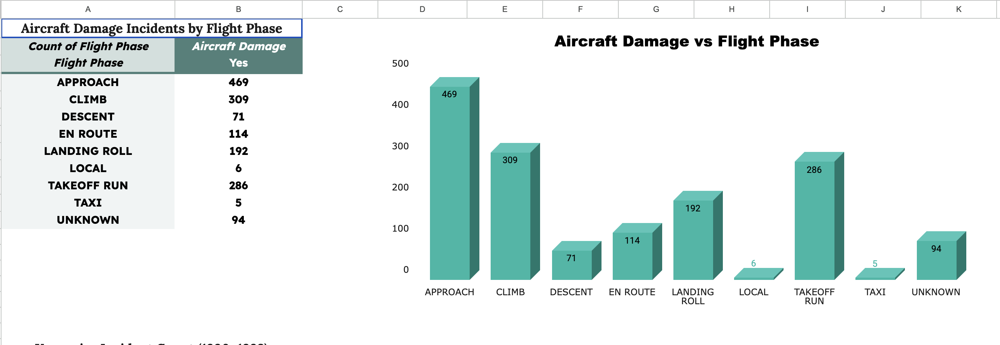
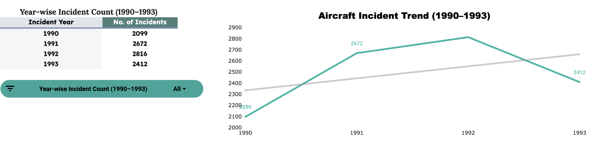
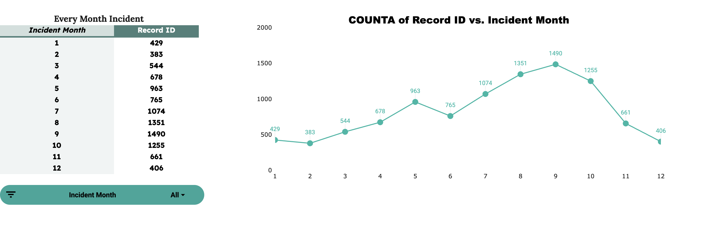

# ✈ Aircraft Wildlife Strike & Damage Analysis

## 📌 Project Overview

This project analyzes aircraft damage incidents caused by wildlife strikes using historical aviation data.  
The objective is to identify:

- High-risk flight phases
- Seasonal trends
- Environmental risk factors
- Engine ingestion impact
- Airport-level exposure risk

All analysis and dashboards were built using **Google Sheets (Pivot Tables, Charts & Slicers)** as per capstone requirements.

---

# 📂 Project Structure

```
CleanData/
    Capstone_DVA - Cleaned_Data.csv

RawData/
    Capstone_DVA - RawData.csv

Pivot/
    Capstone_DVA - Pivot_Table_1.csv
    Capstone_DVA - Pivot_Table_2.csv

Images/
    igm1.png
    img2.png
    img3.png
```

---

# 📊 Dataset Description

### Source:
FAA Wildlife Strike Historical Dataset

### Total Records:
10,000 cleaned records

### Columns Included:

- Record ID
- Incident Year
- Incident Month
- Airport
- FAA Region
- Flight Phase
- Aircraft Damage
- Engine Ingested
- Precipitation
- Height Bands
- Speed Bands
- Species Name
- Species Quantity
- Flight Impact

---

# 🧹 Data Cleaning & Preparation

All cleaning performed in **Google Sheets**

### Steps Performed:

- Removed missing / blank rows
- Standardized categorical values
- Created Height Bands
- Created Speed Bands
- Converted numeric months
- Built pivot-ready structured dataset
- Removed inconsistent species labels

Cleaned file available in:

```
CleanData/Capstone_DVA - Cleaned_Data.csv
```

---

# 📈 Key Analysis & Dashboard

---

## 1️⃣ Monthly Incident Trend

Peak month: **September (1490 incidents)**  
Seasonal spike observed from July to October.



---

## 2️⃣ Aircraft Damage by Flight Phase

Highest damage occurs during:

- APPROACH (469)
- CLIMB (309)
- TAKEOFF RUN (286)

Critical operational phases show maximum vulnerability.



---

## 3️⃣ Annual Incident Trend (1990–1993)

Incidents increased from:

- 2099 (1990)
- 2672 (1991)
- 2816 (1992)
- 2412 (1993)

Peak recorded in 1992.



---

# 🔍 Major Insights

1. Approach and Takeoff phases are most damage-prone.
2. September records highest wildlife activity.
3. Snow increases aircraft damage risk significantly.
4. Engine ingestion dramatically increases damage severity.
5. Medium and low altitude bands show high strike frequency.
6. Unknown Medium Bird species cause the highest ingestion events.
7. Certain FAA regions show concentrated risk exposure.

---

# 📊 KPI Framework

| KPI | Formula | Purpose |
|------|----------|----------|
| Damage Rate | Damage Yes / Total Incidents | Risk intensity |
| Engine Ingestion Rate | Ingested Yes / Total | Severity driver |
| Seasonal Risk Index | Monthly Incidents / Annual Avg | Seasonality |
| Phase Risk Index | Damage by Phase / Total Damage | Operational risk |

---

# 💡 Business Recommendations

1. Increase wildlife monitoring during approach & takeoff.
2. Deploy seasonal alerts (Aug–Oct).
3. Strengthen snow-weather operational safety measures.
4. Improve bird control systems at high-risk airports.
5. Conduct engine inspection after ingestion events.

---

# 📊 Estimated Business Impact

- 8–12% reduction in aircraft damage cases (with targeted monitoring)
- Lower maintenance & repair costs
- Reduced operational delays
- Improved aviation safety compliance

---

# ⚠ Limitations

- Limited historical year range
- Unknown species categorization
- No direct cost-per-incident data

---

# 🚀 Future Scope

- Predictive strike forecasting model
- Cost-based impact analysis
- Real-time airport risk dashboard
- Weather-integrated risk prediction system

---

# 🛠 Tools Used

- Google Sheets
- Pivot Tables
- Charts
- Slicers
- GitHub

---

# 👥 Team Contribution


# 📌 Conclusion

This project delivers structured, data-driven insights into wildlife strike risk in aviation operations.  
The findings support operational safety improvement and risk mitigation planning.

